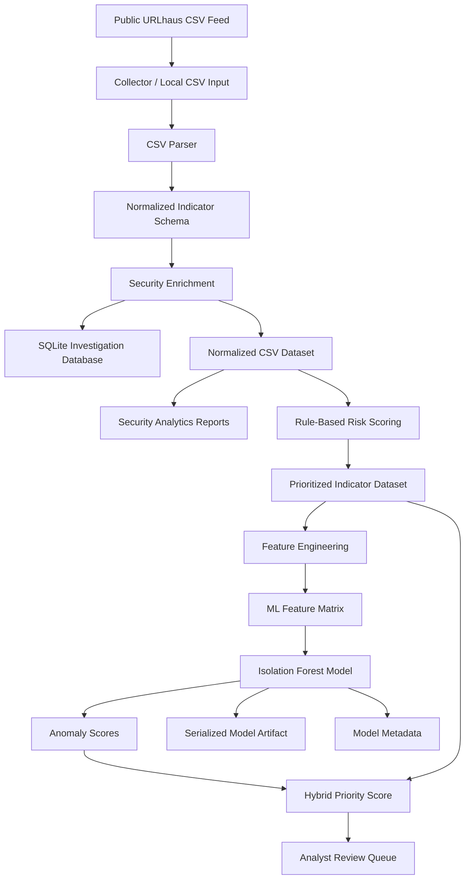

# URLhaus Threat Intelligence Data & ML Pipeline

[](https://www.python.org/)
[](#aiml-engineering-layer)
[](#data-engineering-layer)
[](#cyber-security-layer)

A production-style Python pipeline for processing **real-world malicious URL intelligence** from the public URLhaus feed. The project ingests raw threat-feed data, normalizes and enriches indicators of compromise, stores them in a local investigation database, generates security analytics, and applies an unsupervised ML model to prioritize unusual indicators for analyst review.

This repository is designed as a GitHub-ready portfolio project focused on three areas:

- **Cyber Security**: malicious URL intelligence, IOC enrichment, threat-feed triage, and SOC-style investigation outputs.
- **Data Engineering**: reproducible ingestion, schema normalization, batch processing, SQLite persistence, and generated analytical datasets.
- **AI/ML Engineering**: feature engineering, Isolation Forest anomaly scoring, model serialization, metadata tracking, and ML-assisted prioritization.

The project is defensive and safe to publish. It does not include private company material, customer data, internal screenshots, DDoS tooling, or offensive automation.

---

## Project Motivation

Security operations teams often consume external threat-intelligence feeds that contain thousands of malicious or suspicious URLs. Raw feeds are useful, but they are not immediately ready for investigation, analytics, storage, or machine-learning workflows.

A realistic security data pipeline needs to answer questions such as:

- Which hosts, ports, TLDs, reporters, and threat categories appear most frequently?
- Which indicators use direct IP hosts, non-standard ports, executable payload paths, or suspicious URL patterns?
- Which indicators should an analyst inspect first when the feed is large?
- How can raw threat-feed records be transformed into a deterministic ML feature matrix?
- How can an anomaly model be used without incorrectly claiming to classify benign versus malicious URLs?

This project implements that workflow end to end.

```text
Real-world URLhaus CSV feed
        ↓
Robust ingestion and schema normalization
        ↓
URL, host, IP, port, path, tag, and metadata enrichment
        ↓
SQLite storage + normalized CSV exports
        ↓
Security analytics and investigation reports
        ↓
Rule-based risk scoring
        ↓
ML feature engineering
        ↓
Isolation Forest anomaly scoring
        ↓
Hybrid analyst-priority ranking
```

---

## How This Project Maps to the Target Fields

### Cyber Security Layer

The cyber-security layer focuses on turning malicious URL feed records into operationally useful indicators.

**What it does:**

- Processes URLhaus-style malicious URL indicators.
- Extracts IOC fields such as URL, host, IP address, port, scheme, path, threat type, tags, reporter, and URL status.
- Flags suspicious URL properties such as direct IP hosts, non-standard ports, executable file extensions, and suspicious path keywords.
- Produces analyst-friendly outputs for triage and investigation.

**Real-world application:**

A SOC or threat-intelligence team could use this type of pipeline to convert external feeds into structured enrichment tables, local IOC search databases, blocklist candidates, or analyst review queues.

### Data Engineering Layer

The data-engineering layer makes the pipeline reproducible, structured, and maintainable rather than a one-off script.

**What it does:**

- Reads real-world CSV threat-feed data with metadata comments and inconsistent field formats.
- Normalizes raw rows into a stable indicator schema.
- Writes structured records into SQLite for local investigation.
- Exports cleaned datasets and reusable analytics reports.
- Separates ingestion, enrichment, storage, scoring, modeling, and CLI orchestration into independent modules.

**Real-world application:**

This is similar to an internal batch data pipeline used by a security platform or data team: ingest external data, enforce a schema, persist the records, generate derived datasets, and make the outputs reproducible for downstream analysis or modeling.

### AI/ML Engineering Layer

The AI/ML layer provides anomaly-based prioritization for malicious indicators. It is intentionally designed as an **unsupervised ranking component**, not a supervised malware classifier.

**Model used:**

```text
Isolation Forest from scikit-learn
```

**Why this model:**

URLhaus records are already malicious or suspicious indicators, so the dataset does not provide a balanced benign-versus-malicious label set. In this context, a supervised classifier would be misleading unless additional labeled benign data and analyst-reviewed labels were introduced. Isolation Forest is a better fit because it identifies indicators that are unusual compared with the current threat-feed batch.

**What it does:**

- Builds a deterministic ML-ready feature matrix from URL, host, path, port, status, TLD, and threat metadata.
- Trains an Isolation Forest anomaly-detection baseline.
- Exports anomaly scores, anomaly percentiles, model artifacts, and model metadata.
- Combines ML anomaly percentile with transparent rule-based risk scoring into a `hybrid_priority_score`.

**Real-world application:**

In a corporate SOC workflow, this type of model can help prioritize which malicious indicators should be reviewed first when analysts receive a large feed. The model does not replace human judgment; it provides a reproducible ranking signal.

---

## Main Capabilities

### 1. Real-World Threat Feed Ingestion

- Downloads the latest public URLhaus CSV feed when network access is available.
- Supports offline execution with a small sample dataset included in the repository.
- Handles metadata/comment lines and quoted CSV fields.
- Converts raw feed rows into a consistent internal schema.

### 2. Security Enrichment

The enrichment layer extracts and derives fields such as:

- `scheme`
- `host`
- `host_type`
- `ip_address`
- `registered_domain`
- `tld`
- `port`
- `path`
- `path_depth`
- `file_extension`
- `is_non_standard_port`
- `has_executable_extension`
- `has_suspicious_path_keyword`

### 3. Data Storage and Analytics

The pipeline writes outputs that can be inspected directly or used by downstream tools:

- SQLite database for local IOC investigation.
- Normalized CSV exports.
- Distribution reports for status, threat type, TLD, tags, reporters, ports, and daily trends.
- SQL examples for analyst-style investigation.

### 4. Rule-Based Risk Scoring

The rule-based scoring layer creates transparent triage signals based on explainable security heuristics.

Examples of risk reasons include:

- Direct IP host.
- Non-standard port usage.
- Executable payload extension.
- Suspicious path keyword.
- Online indicator status.
- High-risk threat label or tag combination.

### 5. ML-Assisted Anomaly Prioritization

The ML layer trains an Isolation Forest model on engineered features and exports:

- `urlhaus_ml_feature_matrix.csv`
- `urlhaus_ml_anomaly_scores.csv`
- `isolation_forest.joblib`
- `model_metadata.json`

The final output includes:

```text
risk_score
risk_level
risk_reason
ml_anomaly_score
ml_anomaly_percentile
is_ml_anomaly
hybrid_priority_score
```

---

## Architecture



---

## Repository Structure

```text
urlhaus-threat-intel-pipeline/
├── data/
│   ├── sample/
│   │   └── urlhaus_recent_sample.csv          # Offline demo feed
│   ├── raw/                                   # Downloaded feeds, ignored by Git
│   └── processed/                             # Generated processed datasets, ignored by Git
├── docs/
│   ├── CODE_REVIEW_AND_REFACTOR_REPORT.md
│   ├── DATA_AND_ML_DESIGN.md
│   ├── INTERNSHIP_CONTEXT.md
│   └── SAMPLE_SQL_QUERIES.md
├── reports/
│   └── example/                               # Example reports generated from sample data
├── src/
│   └── urlhaus_threat_intel/
│       ├── analytics.py                       # Analytical CSV/JSON reports
│       ├── cli.py                             # Command-line workflow orchestration
│       ├── collector.py                       # Public feed downloader
│       ├── enrichment.py                      # Indicator normalization and enrichment
│       ├── feature_engineering.py             # ML feature matrix construction
│       ├── modeling.py                        # Isolation Forest anomaly scoring
│       ├── parser.py                          # Robust URLhaus CSV reader
│       ├── risk.py                            # Rule-based risk scoring
│       ├── schema.py                          # Shared schema definitions
│       ├── storage.py                         # SQLite persistence layer
│       └── url_utils.py                       # URL parsing helpers
├── tests/
├── .github/workflows/ci.yml
├── pyproject.toml
├── requirements.txt
├── requirements-dev.txt
└── README.md
```

---

## Quick Start

### 1. Clone the Repository

```bash
git clone <your-repository-url>
cd urlhaus-threat-intel-pipeline
```

### 2. Create a Virtual Environment

Windows PowerShell:

```powershell
python -m venv .venv
.\.venv\Scripts\Activate.ps1
```

macOS / Linux:

```bash
python3 -m venv .venv
source .venv/bin/activate
```

### 3. Install Dependencies

```bash
pip install -r requirements-dev.txt
pip install -e .
```

### 4. Run the Complete Offline Demo

```bash
python -m urlhaus_threat_intel.cli run \
  --input data/sample/urlhaus_recent_sample.csv \
  --output-dir outputs/demo
```

Or use the installed CLI command:

```bash
urlhaus-ti run \
  --input data/sample/urlhaus_recent_sample.csv \
  --output-dir outputs/demo
```

---

## CLI Workflow

### Download the Latest Public Feed

```bash
python -m urlhaus_threat_intel.cli download \
  --output data/raw/urlhaus_recent.csv
```

### Ingest, Normalize, Enrich, and Store Indicators

```bash
python -m urlhaus_threat_intel.cli ingest \
  --input data/sample/urlhaus_recent_sample.csv \
  --db data/processed/threat_intel.db \
  --normalized-output data/processed/urlhaus_normalized.csv
```

### Generate Analytics Reports

```bash
python -m urlhaus_threat_intel.cli analyze \
  --input data/processed/urlhaus_normalized.csv \
  --output-dir reports/generated
```

### Apply Rule-Based Risk Scoring

```bash
python -m urlhaus_threat_intel.cli score \
  --input data/processed/urlhaus_normalized.csv \
  --output data/processed/urlhaus_prioritized_indicators.csv
```

### Train the ML Anomaly Baseline

```bash
python -m urlhaus_threat_intel.cli model \
  --input data/processed/urlhaus_prioritized_indicators.csv \
  --model-output models/isolation_forest.joblib \
  --feature-output data/processed/urlhaus_ml_feature_matrix.csv \
  --metadata-output models/model_metadata.json \
  --scored-output data/processed/urlhaus_ml_anomaly_scores.csv
```

---

## Output Artifacts

After running the complete pipeline, the output directory contains:

```text
outputs/demo/
├── threat_intel.db
├── models/
│   ├── isolation_forest.joblib
│   └── model_metadata.json
├── processed/
│   ├── urlhaus_normalized.csv
│   ├── urlhaus_prioritized_indicators.csv
│   ├── urlhaus_ml_feature_matrix.csv
│   └── urlhaus_ml_anomaly_scores.csv
└── reports/
    ├── daily_trend.csv
    ├── status_distribution.csv
    ├── summary.json
    ├── threat_distribution.csv
    ├── top_ports.csv
    ├── top_reporters.csv
    ├── top_tags.csv
    └── top_tlds.csv
```

| Artifact | Purpose |
|---|---|
| `urlhaus_normalized.csv` | Cleaned and enriched indicator dataset. |
| `threat_intel.db` | SQLite database for IOC search and investigation. |
| `summary.json` | High-level feed summary. |
| `top_ports.csv` | Port distribution and non-standard port review. |
| `top_tlds.csv` | TLD distribution for infrastructure analysis. |
| `urlhaus_prioritized_indicators.csv` | Rule-based risk score, risk level, and risk reasons. |
| `urlhaus_ml_feature_matrix.csv` | Deterministic model input table. |
| `urlhaus_ml_anomaly_scores.csv` | ML anomaly scores and hybrid priority ranking. |
| `isolation_forest.joblib` | Serialized ML pipeline artifact. |
| `model_metadata.json` | Model configuration, feature schema, and usage notes. |

---

## ML Design

### Learning Task

```text
Unsupervised anomaly scoring within a malicious URL feed
```

The model ranks indicators that look unusual relative to the current batch. It does not classify URLs as benign or malicious.

### Model

```text
Isolation Forest
```

Isolation Forest is suitable here because the project works with real-world feed data where analyst-reviewed priority labels are not available by default.

### Feature Engineering

The model uses deterministic tabular features derived from URL and threat-feed metadata.

Examples:

```text
host_entropy
host_digit_ratio
path_depth
path_length
path_digit_ratio
url_length
tag_count
is_ip_host
is_default_port
is_non_standard_port
has_executable_extension
has_suspicious_path_keyword
scheme_http
scheme_https
host_type_ip
url_status_online
threat_malware_download
tld_com
```

### Hybrid Prioritization

The final `hybrid_priority_score` combines:

```text
65% ML anomaly percentile + 35% rule-based risk score
```

This creates a practical ranking signal that is both model-assisted and explainable.

---

## SQLite Investigation Examples

Find the most frequent malicious hosts:

```sql
SELECT host, COUNT(*) AS indicator_count
FROM indicators
GROUP BY host
ORDER BY indicator_count DESC
LIMIT 20;
```

Find online indicators using non-standard ports:

```sql
SELECT url, host, port, threat, tags
FROM indicators
WHERE url_status = 'online'
  AND is_non_standard_port = 1
ORDER BY dateadded_utc DESC
LIMIT 50;
```

Find executable payload paths:

```sql
SELECT url, file_extension, tags, reporter
FROM indicators
WHERE has_executable_extension = 1
ORDER BY dateadded_utc DESC;
```

---

## Testing and Quality Checks

Run unit tests:

```bash
pytest
```

Run linting:

```bash
ruff check src tests
```

Run the complete demo pipeline:

```bash
python -m urlhaus_threat_intel.cli run \
  --input data/sample/urlhaus_recent_sample.csv \
  --output-dir outputs/demo
```

The repository also includes GitHub Actions CI for automated test and lint checks.

---

## Corporate-Style Engineering Practices Demonstrated

This repository is structured like a small internal security data product rather than a notebook-only experiment:

- Modular package under `src/`.
- CLI commands for reproducible batch execution.
- Explicit schema definitions.
- Separate ingestion, enrichment, analytics, scoring, modeling, and storage layers.
- Local database persistence.
- Generated model artifacts and metadata.
- Unit tests for parsing, enrichment, feature engineering, and modeling.
- Linting and CI configuration.
- Sample data for offline reproducibility.
- Ignored raw/generated folders to avoid committing large or frequently changing data.

---

## Safety and Scope

This project is strictly defensive. It is intended for threat-intelligence processing, data engineering, and ML-assisted prioritization.

It does not include:

- Internal company documents.
- Private customer data.
- Screenshots from production systems.
- Exploit code.
- DDoS tooling.
- Automated attack functionality.

---

## Future Improvements

- Add ASN and GeoIP enrichment from offline lookup databases.
- Add public suffix list parsing for more accurate registered-domain extraction.
- Add dashboard visualizations for SOC-style reporting.
- Add analyst-reviewed labels for supervised learning experiments.
- Add daily feed comparison to detect new hosts, campaigns, and infrastructure shifts.
- Add model monitoring for feature drift across daily threat-feed batches.

---

## License

This project is licensed under the MIT License.
